 

**[Portfolio](https://saipreethimudrakola.github.io/SaipreethiMudrakola/)** &nbsp;·&nbsp; **[LinkedIn](https://linkedin.com/in/your-handle)** &nbsp;·&nbsp; **[Email](mailto:you@example.com)**

## About

Senior Business Analyst with 4+ years across banking and healthcare, bridging business and technology. I turn complex needs into clear requirements, and clear requirements into solutions that ship — across Agile Scrum, Waterfall and SDLC environments.

My work sits at the intersection of **business process analysis**, **data-driven decision-making** and **enterprise technology**: requirements, reporting, UAT and the stakeholders who hold it all together.

## Experience

| | Role | Focus |
|---|---|---|
| **TD Bank** Feb 2026 – Present | Senior Business Analyst | Banking transformation across payments, deposits, lending and digital banking; requirements, backlog, UAT and Power BI reporting |
| **Aveanna Healthcare** Feb 2025 – Dec 2025 | Business Analyst | Healthcare workflows, cloud migration, data governance and KPI reporting for 1M+ records |
| **ANZ** Jul 2022 – Dec 2023 | Data & Business Analyst | SQL analysis of trading, risk and P&L data; Power BI dashboards; Excel and VBA automation |
| **Wells Fargo** Apr 2021 – Jun 2022 | Business Analyst | Lending, payments and retail banking requirements; regulatory reporting; process optimisation |

## Expertise

| | |
| **Business Analysis** | Requirements Elicitation · BRD / FRD · User Stories · Acceptance Criteria · Use Cases · RTM · Gap Analysis · Process Mapping · BPMN · BPR |
| **Agile & Delivery** | Agile Scrum · Product Owner Support · Backlog Management · Sprint Planning · Release Planning · SDLC · Waterfall |
| **Testing & UAT** | UAT Planning & Coordination · Test Case Review · Defect Management · Production Validation · Business Sign-off |
| **Transformation** | Digital Transformation · Change Management · Risk Management · Root Cause Analysis · Strategic Planning |
| **Data & Reporting** | SQL · Data Analysis · KPI Reporting · Data Governance · Data Quality · Data Migration · Data Modeling · ETL |
| **BI & Analytics** | Power BI · Tableau · Advanced Excel · Power Query · VBA · Python · R |
| **Tools** | JIRA · Azure DevOps · Confluence · MS Project · Visio · Lucidchart · Balsamiq · SharePoint |
| **Platforms & Cloud** | AWS · Azure · GCP · Snowflake · BigQuery · Redshift · Salesforce · SAP · REST / SOAP APIs · Postman |

## Projects

<i>The kitchen is busy. Good things take time — check back soon.</i>

## Education

**Master's in Information Systems Management** — Wilmington University, USA &nbsp;·&nbsp; 2024 – 2025

## Connect

Open to conversations about business analysis, data and digital transformation.

**[saipreethimudrakola.github.io/SaipreethiMudrakola](https://saipreethimudrakola.github.io/SaipreethiMudrakola/)**

 
Built with intention · Still cooking

